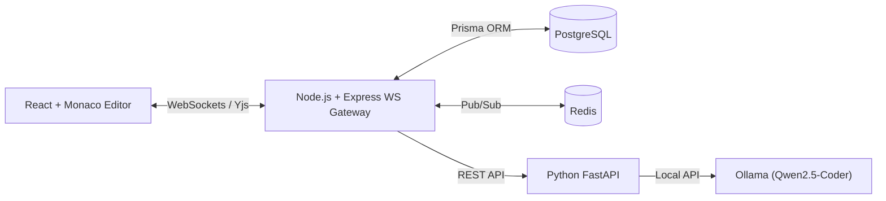

# PeerCode

> Real-time collaborative code editor with local AI-powered peer review.

PeerCode is an open-source collaborative code editor designed for real-time pair programming and instant local AI feedback. It pairs CRDT-based document synchronization with a local LLM microservice (`Qwen2.5-Coder:7b` via Ollama) to analyze code for logical bugs, performance bottlenecks, and code smells without transmitting code to third-party cloud APIs.

---

## Key Features

- **Real-time Collaboration**: Multi-user concurrent code editing powered by Yjs CRDTs over WebSockets.
- **Awareness & Presence**: Real-time multi-cursor position tracking and active collaborator indicators.
- **Local AI Peer Review**: Automated background code analysis using `Qwen2.5-Coder 7B` via Ollama.
- **Multi-Language Support**: Syntax highlighting and specialized AI review rules for JavaScript, TypeScript, Python, and C++.
- **Session Restoration & Snapshots**: Automated state saving to PostgreSQL with session reload capabilities.
- **Structured Code Insights**: Line-level editor markers for detected bugs, smells, unused variables, and optimization opportunities.

---

## Tech Stack

| Layer | Technologies |
| :--- | :--- |
| **Frontend** | React 18, TypeScript, Monaco Editor, Tailwind CSS, React Router |
| **Realtime Engine** | Yjs (CRDT), WebSockets (`y-websocket`, `y-monaco`) |
| **Backend API** | Node.js, Express, TypeScript, Prisma ORM |
| **Database & Cache** | PostgreSQL 16, Redis 7 |
| **AI Microservice** | Python 3.11, FastAPI, Pydantic, Ollama (`Qwen2.5-Coder:7b`) |
| **Infrastructure** | Docker Compose |

---

## Architecture Overview



For comprehensive details on system flow and sequence diagrams, refer to [docs/ARCHITECTURE.md](docs/ARCHITECTURE.md).

---

## Monorepo Layout

```
PeerCode/
├── apps/
│   ├── frontend/         # React application & Monaco Editor interface
│   ├── backend/          # Express API & WebSocket collaboration gateway
│   └── ai-service/       # FastAPI AI code review service
├── packages/
│   └── shared/           # Shared TypeScript contracts and types
├── docker/
│   └── docker-compose.yml# PostgreSQL & Redis infrastructure
└── docs/                 # Architectural & engineering guidelines
```

---

## Local Setup

### Prerequisites
- Node.js >= 18.x and `npm`
- Python >= 3.10
- Docker & Docker Compose
- [Ollama](https://ollama.ai/) installed locally with `qwen2.5-coder:7b` pulled (`ollama pull qwen2.5-coder:7b`)

### 1. Repository Setup
```bash
git clone https://github.com/Shivang-Mishra-20/PeerCode.git
cd PeerCode
npm install
```

### 2. Start Infrastructure (PostgreSQL & Redis)
```bash
npm run docker:up
```

### 3. Configure Environment Variables
Copy `.env.example` templates in root, `apps/backend/`, and `apps/ai-service/`:
```bash
cp .env.example .env
cp apps/backend/.env.example apps/backend/.env
cp apps/ai-service/.env.example apps/ai-service/.env
```

---

## Development Commands

```bash
# Run Frontend
npm run dev:frontend

# Run Backend
npm run dev:backend

# Run AI Service
npm run dev:ai
```

---

## Future Enhancements

See [PROJECT_PROGRESS.md](PROJECT_PROGRESS.md) for planned future extensions.
