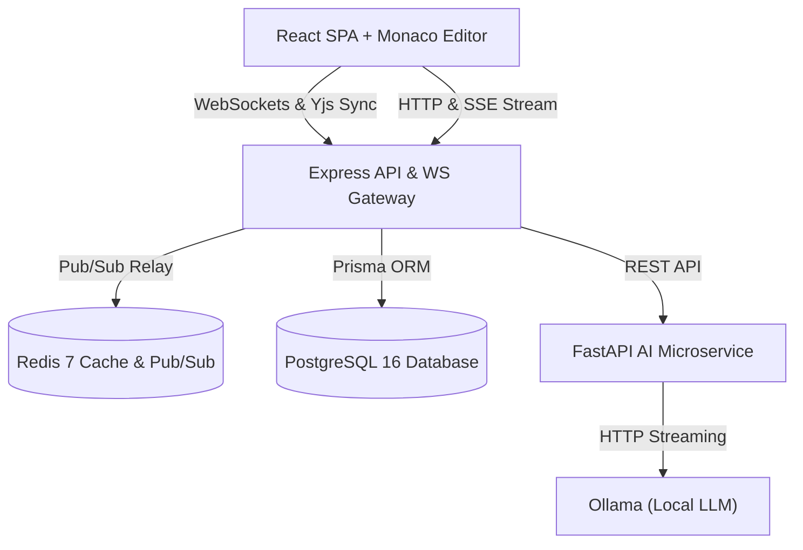

# PeerCode

[](LICENSE)
[](docker-compose.yml)
[](apps/backend/package.json)
[](apps/ai-service/pyproject.toml)

> A real-time collaborative code editor with local AI-powered code review.

PeerCode is an open-source collaborative code editor built for real-time pair programming and instant local AI feedback. It pairs Conflict-Free Replicated Data Types (Yjs CRDTs) with a local Ollama model to analyze code for bugs, smells, and optimization opportunities—without transmitting code to cloud APIs.

---

## Overview

PeerCode enables seamless pair programming for engineering teams through real-time, lock-free code editing. Multiple developers can write, edit, and navigate shared code simultaneously over low-latency WebSockets without merge conflicts or lost keystrokes.

It provides private code intelligence by running line-level AI peer reviews locally via Ollama. By executing models on host system infrastructure, PeerCode delivers instant, automated code reviews with zero per-token API charges while helping keep source code on the developer's machine.

---

## Core Features

### Real-Time Collaboration

- **Yjs CRDT Sync**: Lock-free multi-client editing with eventual consistency.
- **WebSocket Gateway**: Low-latency event streaming over `y-websocket`.
- **Live Presence**: Real-time remote cursor tracking and user presence indicators.

### AI-Powered Code Review

- **Local AI Analysis**: Private, local code reviews via Ollama without data egress.
- **SSE Token Streaming**: Real-time token streaming directly into an interactive review panel.
- **Monaco Diagnostics**: Automated editor markers highlighting bugs, code smells, and unused variables.
- **Explainable Suggestions**: Actionable review tabs (Summary, Issues, Refactor, Metadata).

### Persistence & Infrastructure

- **PostgreSQL Snapshots**: Background persistence for room states and snapshot history.
- **Redis Pub/Sub & Caching**: Session state caching and multi-node Pub/Sub broadcasting.
- **Docker-First Environment**: Single-command containerized setup via Docker Compose V2.

---

## Tech Stack

| Layer                  | Technologies                                                   |
| :--------------------- | :------------------------------------------------------------- |
| **Frontend**           | React 18, TypeScript, Monaco Editor, Tailwind CSS, Vite        |
| **Real-Time Engine**   | Yjs (CRDT), WebSockets (`y-websocket`, `y-monaco`)             |
| **Backend Gateway**    | Node.js, Express, TypeScript, Prisma ORM                       |
| **Database & Caching** | PostgreSQL 16, Redis 7                                         |
| **AI Microservice**    | Python 3.11, FastAPI, Pydantic v2, Ollama (`Qwen2.5-Coder:7b`) |
| **Infrastructure**     | Docker Compose V2                                              |

---

## System Architecture



For full sequence diagrams and subsystem breakdowns, refer to [docs/ARCHITECTURE.md](docs/ARCHITECTURE.md).

---

## Project Structure

```text
PeerCode/
├── apps/
│   ├── frontend/         # React SPA & Monaco Editor UI (Port 3000)
│   ├── backend/          # Express API & WebSocket Gateway (Port 4000)
│   └── ai-service/       # FastAPI AI microservice (Port 8000)
├── packages/
│   └── shared/           # Shared TypeScript interfaces & API contracts
├── docs/                 # Architectural specifications & engineering design decisions
│   ├── ARCHITECTURE.md
│   └── DESIGN_DECISIONS.md
├── docker-compose.yml    # Root Docker Compose infrastructure
├── CONTRIBUTING.md       # Contribution guidelines
└── LICENSE               # MIT License
```

---

## Local Setup

### Prerequisites

- [Docker Desktop](https://www.docker.com/products/docker-desktop/) with Docker Compose V2
- [Ollama](https://ollama.ai/) installed on host system with `qwen2.5-coder:7b`:
  ```bash
  ollama pull qwen2.5-coder:7b
  ```

### Docker-First Development (Recommended)

```bash
git clone https://github.com/Shivang-Mishra-20/PeerCode.git
cd PeerCode

# Launch all 5 microservices in daemon mode
docker compose up -d
```

Verify running services:

- **Frontend SPA**: [http://localhost:3000](http://localhost:3000)
- **Backend Health Check**: [http://localhost:4000/health](http://localhost:4000/health)
- **AI Microservice Health**: [http://localhost:8000/health](http://localhost:8000/health)

### Standalone Native Development (Optional)

If running without Docker, start individual services using workspace scripts:

```bash
npm install
npm run dev:backend   # Starts Express gateway (Port 4000)
npm run dev:frontend  # Starts Vite SPA (Port 3000)
npm run dev:ai        # Starts FastAPI microservice (Port 8000)
```

---

## Environment Variables

Default port allocations, database URLs, and service connection strings are defined in the repository environment templates. To customize settings, copy the respective `.env.example` files:

```bash
cp .env.example .env
cp apps/backend/.env.example apps/backend/.env
cp apps/ai-service/.env.example apps/ai-service/.env
cp apps/frontend/.env.example apps/frontend/.env
```

Refer to [.env.example](.env.example), [apps/backend/.env.example](apps/backend/.env.example), and [apps/ai-service/.env.example](apps/ai-service/.env.example) for all available options.

---

## Roadmap

- **Completed**:
  - Lock-free Yjs CRDT document synchronization over WebSockets.
  - Redis 7 pub/sub state relay and PostgreSQL 16 persistence.
  - Live SSE streaming AI code review gateway.
  - Monaco editor markers and tabbed AI review drawer UI.
  - Containerized environment via Docker Compose V2.
- **Planned**:
  - Multi-file project workspace navigation.
  - Custom static code review rules.
  - Role-based room access control.

Detailed milestone tracking is available in [PROJECT_PROGRESS.md](PROJECT_PROGRESS.md).

---

## Documentation

- [System Architecture Specification](docs/ARCHITECTURE.md): Full component breakdown and sequence diagrams.
- [Engineering Design Decisions](docs/DESIGN_DECISIONS.md): Technology rationale and trade-off analysis.

---

## License

This project is licensed under the [MIT License](LICENSE).
