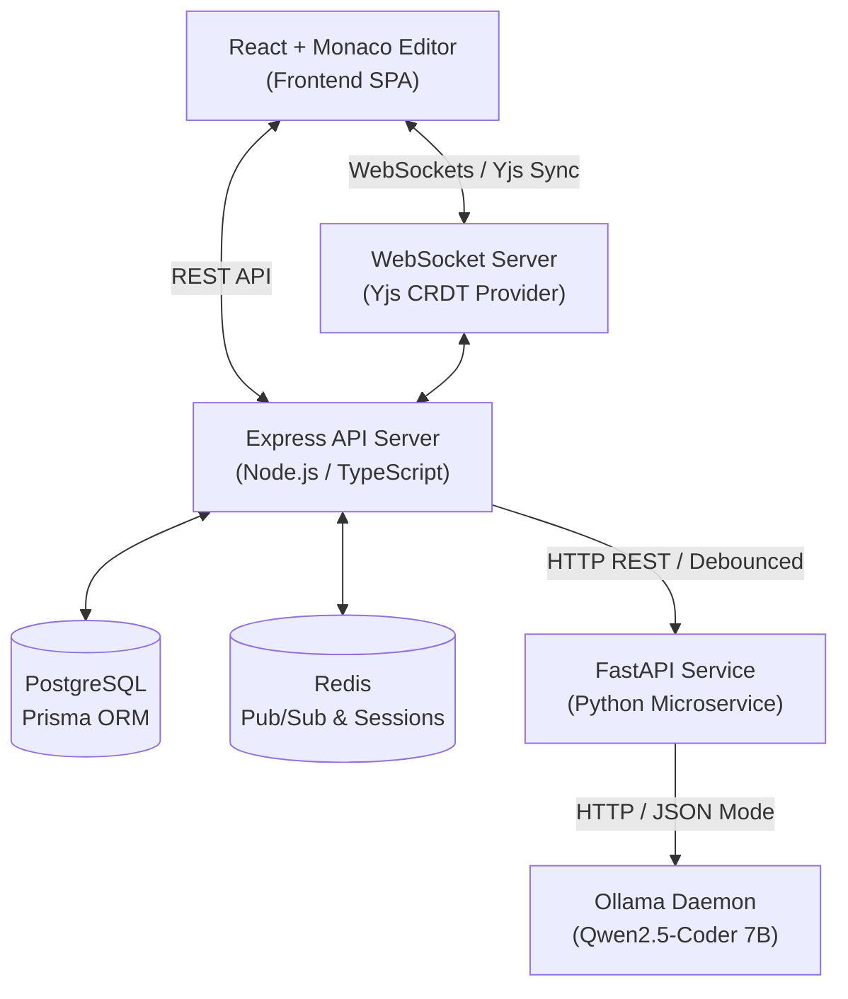
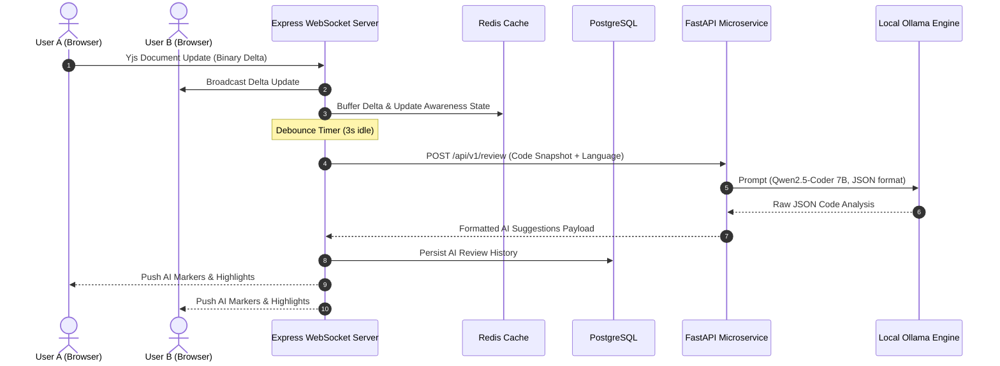

# PeerCode System Architecture

## Overview

PeerCode is a distributed, real-time collaborative code editor equipped with automated, local AI peer review. The architecture decouples real-time CRDT document synchronization from CPU/GPU-intensive AI inference microservices.



---

## Key Subsystems

### 1. Frontend Client (`apps/frontend`)
- **UI Framework**: React 18 with Vite, TypeScript, and Tailwind CSS.
- **Code Editor**: Monaco Editor (VS Code core engine).
- **CRDT Layer**: `yjs` + `y-monaco` + `y-websocket` for lock-free multi-user document state convergence and live cursor awareness.

### 2. Primary Backend (`apps/backend`)
- **Runtime**: Node.js with Express and TypeScript.
- **WebSocket Gateway**: Manages real-time room sessions, relays CRDT delta updates across connected peers, and publishes state events to Redis.
- **Persistence**: PostgreSQL via Prisma ORM for room configurations, snapshot history, and past AI review records.
- **State Buffer**: Redis for pub/sub messaging across WS nodes and fast transient session state storage.

### 3. AI Peer Review Microservice (`apps/ai-service`)
- **Runtime**: Python 3.11 with FastAPI and Pydantic.
- **Model Engine**: Local Ollama instance serving `Qwen2.5-Coder:7b`.
- **Structured Output**: Strict JSON enforcement for line-level suggestions (`bug`, `smell`, `inefficiency`, `unused`).
- **Concurrency & Queueing**: Server-side room debouncing (3s idle threshold) and asynchronous request queuing to prevent local hardware saturation.

---

## Data Flow Sequence



---

## Directory Topology (Monorepo Layout)

```
PeerCode/
├── apps/
│   ├── frontend/         # React SPA + Monaco Editor + Yjs client
│   ├── backend/          # Express API + WebSocket Gateway + Prisma ORM
│   └── ai-service/       # FastAPI + Ollama integration microservice
├── packages/
│   └── shared/           # Shared TypeScript interfaces & API contracts
├── docker/
│   └── docker-compose.yml# PostgreSQL 16 & Redis 7 services
├── docs/
│   ├── ARCHITECTURE.md   # Architectural reference & diagrams
│   └── CONVENTIONS.md    # Development standards & guidelines
├── .env.example          # Root environment template
├── package.json          # Root npm workspace manifest
└── PROJECT_PROGRESS.md   # Development tracker & milestone status
```
