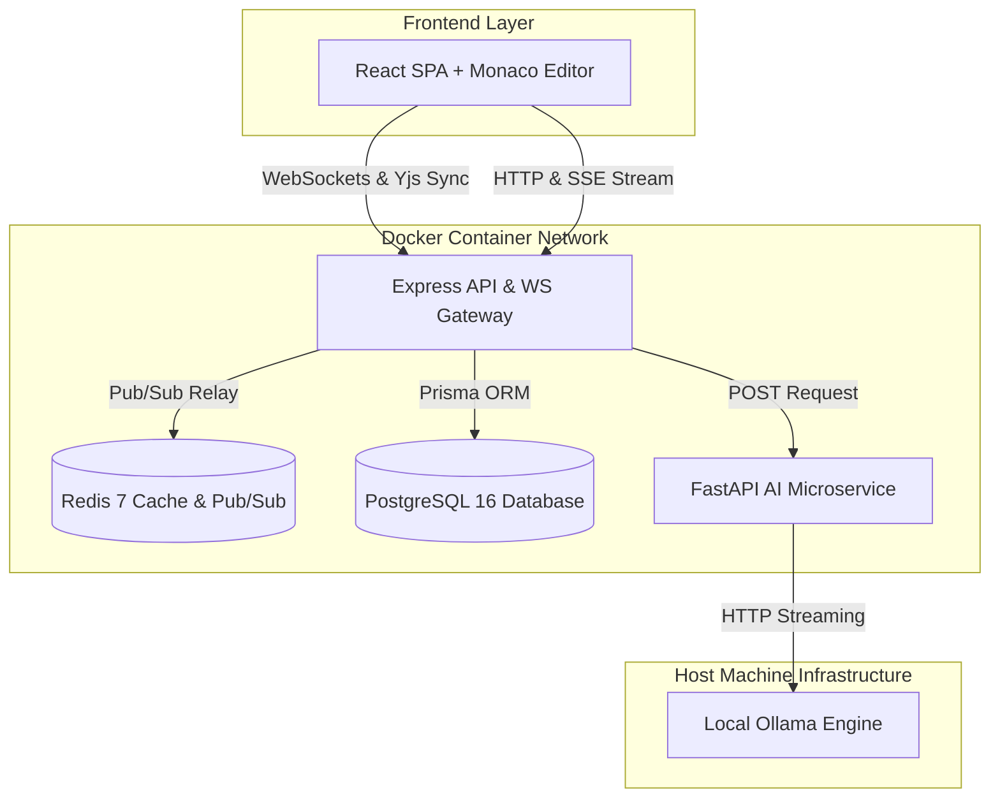
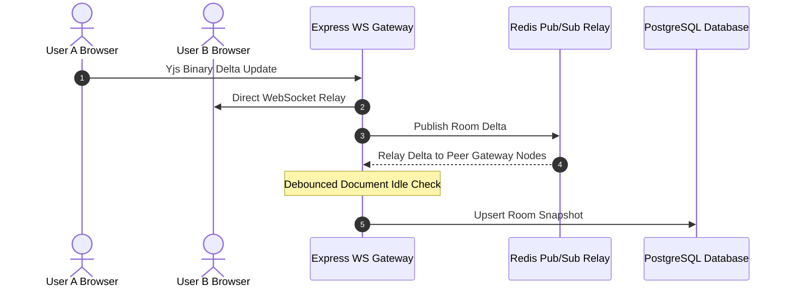
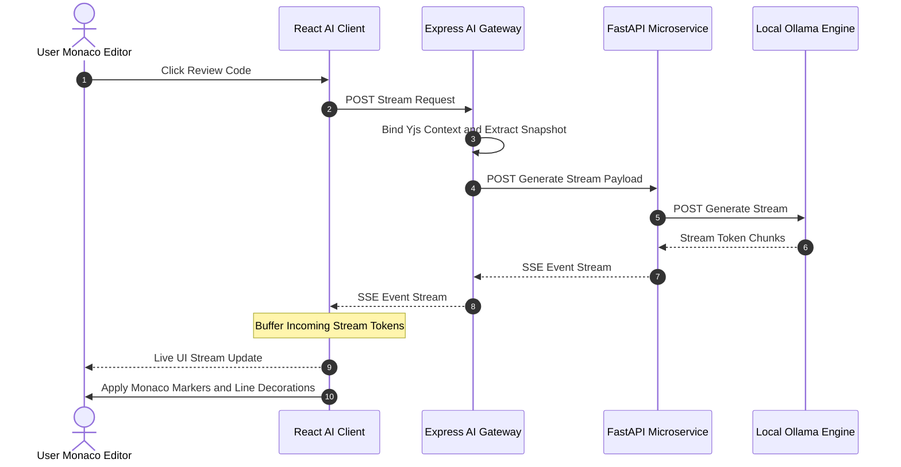
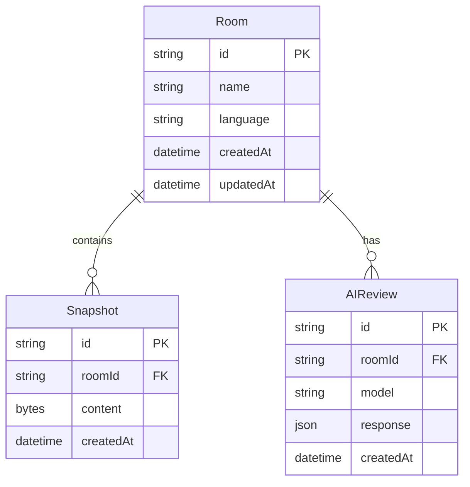

# PeerCode System Architecture

## Overview

PeerCode is a real-time collaborative code editor equipped with local AI peer review capabilities. The architecture decouples real-time CRDT document synchronization from local AI inference microservices.

---

## 1. System Architecture Topology



---

## 2. Core Components

### A. Frontend Client (`apps/frontend`)
- **Framework**: React 18 with Vite, TypeScript, and Tailwind CSS.
- **Code Editor**: Monaco Editor (VS Code core editing engine).
- **CRDT Synchronization**: `yjs` + `y-monaco` + `y-websocket` for lock-free multi-user document state convergence and live awareness tracking (remote collaborator cursors and selections).
- **AI Integration Client**: Dedicated SSE streaming client (`aiClient.ts`), modular review drawer (`AIReviewDrawer`), and isolated Monaco diagnostic managers (`monacoMarkers.ts` and `monacoDecorations.ts`).

### B. Express Backend Gateway (`apps/backend`)
- **Runtime**: Node.js with Express and TypeScript.
- **WebSocket Gateway**: Manages real-time room sessions, relays Yjs CRDT binary deltas across connected clients, and synchronizes state across backend instances via Redis Pub/Sub.
- **AI Gateway & Context Binding**: Captures current room document snapshots and proxies review requests to the FastAPI microservice using Server-Sent Events (SSE).
- **Persistence & Diagnostics**: Manages database migrations via Prisma ORM, stores room snapshots in PostgreSQL, and exposes a structured health endpoint (`/health`) with isolated dependency reporting (`postgres`, `redis`, `ai_service`, `ollama`).

### C. FastAPI AI Microservice (`apps/ai-service`)
- **Runtime**: Python 3.11 with FastAPI and Pydantic v2 schemas.
- **Model Integration**: Communicates with local Ollama engine serving `qwen2.5-coder:7b`.
- **Streaming & Verification**: Validates incoming prompt requests, enforces JSON output formats for code reviews, and streams live tokens back to the Express gateway using SSE.

---

## 3. Real-Time Collaboration Sequence



---

## 4. Live SSE AI Peer Review Sequence



---

## 5. Component & Database Entity Diagram



---

## 6. Monorepo Directory Topology

```text
PeerCode/
├── apps/
│   ├── frontend/         # React SPA + Monaco Editor + Yjs client
│   │   ├── src/          # Components, hooks, services, utils
│   │   └── Dockerfile    # Developer-first Dockerfile (Port 3000)
│   ├── backend/          # Express API + WebSocket Gateway + Prisma ORM
│   │   ├── src/          # Routes, sockets, services, lib
│   │   ├── prisma/       # PostgreSQL schema definition
│   │   └── Dockerfile    # Developer-first Dockerfile (Port 4000)
│   └── ai-service/       # FastAPI + Ollama microservice
│       ├── app/          # Main application, routes, services
│       └── Dockerfile    # Developer-first Dockerfile (Port 8000)
├── packages/
│   └── shared/           # Shared TypeScript types & API contracts
├── docs/                 # Architectural references & technical decisions
│   ├── ARCHITECTURE.md   # System architecture & sequence diagrams
│   └── DESIGN_DECISIONS.md # Engineering rationale & technology trade-offs
├── .env.example          # Root environment template
├── docker-compose.yml    # Root Docker Compose specification
└── package.json          # Monorepo workspace configuration
```
